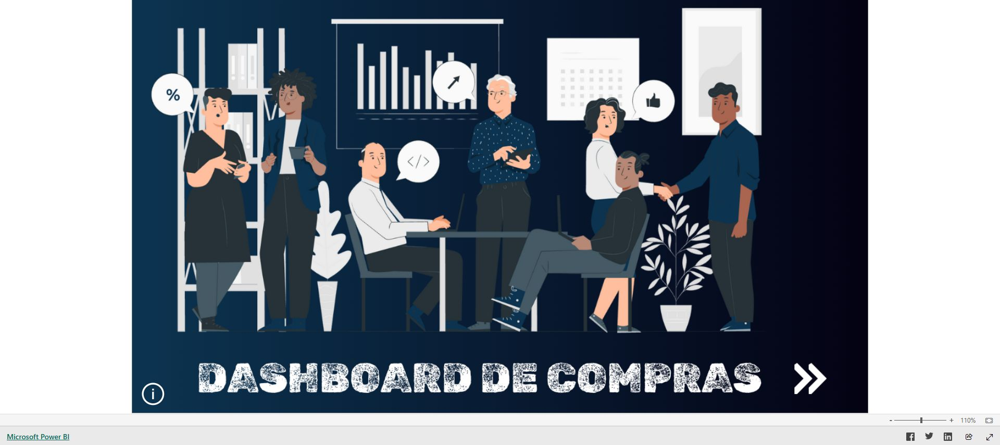

# Performance de Fornecedores

Projeto de Power BI voltado ao acompanhamento do processo de compras e do
desempenho dos fornecedores.

## Objetivo

Apoiar negociações, acompanhar prazos e qualidade das entregas e identificar
oportunidades de redução de custos no setor de compras.

## Dashboard

[Abrir o dashboard no Power BI](https://app.powerbi.com/view?r=eyJrIjoiMTlkN2M4YjQtNTZlOS00YTU3LTk5OTctMmJmYjY1MTRmNzVjIiwidCI6ImQ0YTM3MWYxLTI5MjItNGE5YS1hOTZkLTQyNmM5YzRlNDBlOSJ9&pageName=09690f0ffa046dd75b0e)

## Tecnologias

- Power BI
- Power Query
- Modelagem de dados
- DAX
- Indicadores de compras

## Principais indicadores

- savings obtido nas compras;
- evolução dos custos;
- lead time de entrega;
- qualidade das entregas;
- volume e custo por fornecedor;
- desempenho dos produtos adquiridos;
- comparação entre fornecedores.

## Perguntas de negócio

1. Quanto foi economizado nas negociações?
2. Quais fornecedores apresentam melhor prazo?
3. Quais entregas possuem problemas de qualidade?
4. Quais fornecedores concentram os maiores custos?
5. Como os preços evoluem ao longo do tempo?
6. Qual fornecedor oferece a melhor combinação entre custo, prazo e qualidade?

## Processo de desenvolvimento

1. Definição dos indicadores estratégicos de compras.
2. Tratamento dos dados de pedidos, itens e fornecedores.
3. Criação dos relacionamentos do modelo.
4. Desenvolvimento das métricas de savings, prazo e qualidade.
5. Construção e validação do dashboard.

## Valor para o negócio

O painel fornece argumentos para negociação, auxilia a avaliação de fornecedores
e melhora o controle de custos, estoques e prazos de entrega.

## Observação

Os dados utilizados são fictícios e foram disponibilizados para fins
educacionais.

