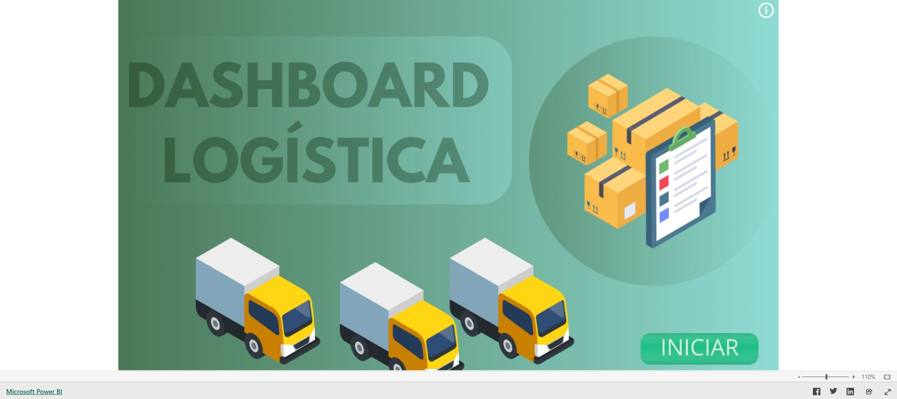

# Performance de Transportadoras

Dashboard de Power BI desenvolvido para acompanhar entregas, custos logísticos,
prazos e ocorrências das transportadoras.

## Objetivo

Centralizar os principais indicadores logísticos para identificar atrasos,
comparar transportadoras e encontrar oportunidades de melhoria operacional.

## Dashboard

[Abrir o dashboard no Power BI](https://app.powerbi.com/view?r=eyJrIjoiZTVhOGRlYzktMWYwMS00MDZjLTgwNGQtMTkyMGZhY2QyYzk3IiwidCI6ImQ0YTM3MWYxLTI5MjItNGE5YS1hOTZkLTQyNmM5YzRlNDBlOSJ9&pageName=137154398d43a5dd4030)

## Tecnologias

- Power BI
- Power Query
- Modelagem de dados
- DAX
- Indicadores logísticos

## Principais análises

- entregas realizadas dentro e fora do prazo;
- quantidade de dias em trânsito;
- principais motivos de problemas nas entregas;
- volume transportado por transportadora;
- custos de frete, pedidos e mercadorias;
- origem e destino dos transportes;
- evolução dos custos logísticos;
- comparação de performance entre transportadoras.

## Perguntas de negócio

1. Qual é a taxa de entregas realizadas no prazo?
2. Quais transportadoras apresentam mais atrasos?
3. Quais ocorrências afetam as entregas?
4. Quanto é gasto com cada transportadora?
5. Quais rotas concentram mais volume e custos?
6. Como os custos logísticos evoluem ao longo do tempo?

## Processo de desenvolvimento

1. Mapeamento dos indicadores de prazo, custo e ocorrência.
2. Tratamento e padronização dos registros logísticos.
3. Construção do modelo de dados.
4. Desenvolvimento dos cálculos de prazo e performance.
5. Criação do painel e validação das comparações.

## Valor para o negócio

O dashboard apoia a escolha e a negociação com transportadoras, melhora a
visibilidade sobre atrasos e contribui para reduzir custos e ocorrências.

## Observação

Os dados utilizados são fictícios e destinados exclusivamente à demonstração do
projeto.

