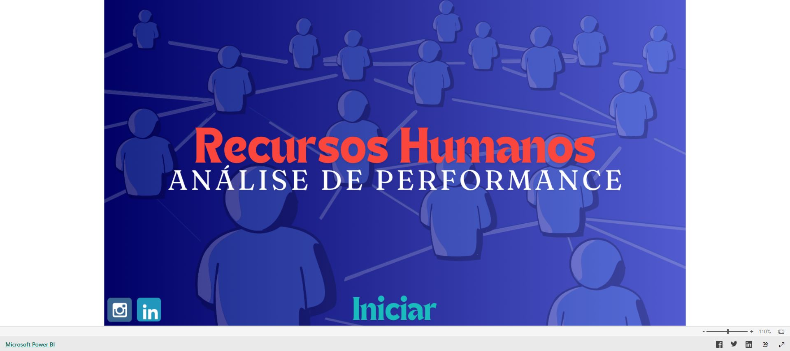

# Recursos Humanos e Turnover

Dashboard de People Analytics criado para analisar o perfil dos colaboradores,
a rotatividade e a estrutura organizacional.

## Objetivo

Transformar dados de colaboradores em indicadores que apoiem decisões de
retenção, remuneração, diversidade e planejamento da força de trabalho.

## Dashboard

[Abrir o dashboard no Power BI](https://app.powerbi.com/view?r=eyJrIjoiYjU3NTA1NjAtNzEwMi00MzdmLWE5MTYtMjIyNTVmN2I1YWMzIiwidCI6ImQ0YTM3MWYxLTI5MjItNGE5YS1hOTZkLTQyNmM5YzRlNDBlOSJ9)

## Tecnologias

- Power BI
- Power Query
- Modelagem de dados
- DAX
- People Analytics

## Principais análises

- perfil e distribuição dos colaboradores;
- distribuição por gênero, setor e cargo;
- comparação salarial;
- situação atual dos funcionários;
- taxa de turnover;
- principais motivos de desligamento;
- movimentação da força de trabalho.

## Perguntas de negócio

1. Qual é o perfil atual dos colaboradores?
2. Quais áreas possuem maior concentração de pessoas?
3. Qual é a taxa de rotatividade?
4. Quais motivos geram mais desligamentos?
5. Existem diferenças salariais relevantes entre cargos ou setores?
6. Quais grupos merecem maior atenção nas ações de retenção?

## Processo de desenvolvimento

1. Definição das perguntas de gestão de pessoas.
2. Tratamento e classificação dos dados de colaboradores.
3. Criação do modelo analítico.
4. Desenvolvimento das métricas de perfil e turnover.
5. Construção dos visuais e validação dos filtros.

## Valor para o negócio

O dashboard ajuda a identificar padrões de rotatividade, apoiar políticas de
retenção e compreender melhor a composição da organização.

## Observação

Os dados utilizados são fictícios e destinados a fins educacionais.

