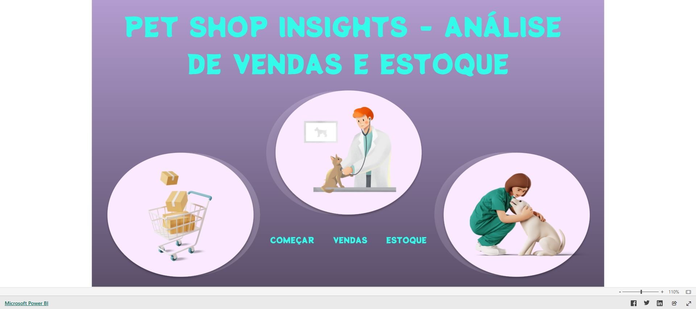

# Vendas e Estoque - Pet Shop

Projeto de Power BI criado para integrar a análise de vendas, produtos,
estoque, marcas e fornecedores de um pet shop.

## Objetivo

Oferecer uma visão gerencial que ajude um pequeno negócio a acompanhar o
desempenho comercial, identificar produtos relevantes e reduzir riscos de
ruptura ou excesso de estoque.

## Dashboard

[Abrir o dashboard no Power BI](https://app.powerbi.com/view?r=eyJrIjoiMGFhMTIxZjctYTk2Yi00MmE3LWI3YjQtMDYyNjg3OWIzOWNjIiwidCI6IjI0OTQ3ZDIyLTUyYTMtNGFjNS1iZTM3LTQ2ZTVjMzUzMDFiMSJ9&pageName=c65af7a7ad9868ce4f86)

## Tecnologias

- Power BI
- Power Query
- Modelagem de dados
- DAX
- Visualização de indicadores

## Principais análises

- receita por categoria de produto;
- evolução das vendas ao longo do tempo;
- produtos e marcas com melhor desempenho;
- comparação entre demanda e estoque disponível;
- tempo médio de saída dos produtos;
- custos e desempenho dos fornecedores;
- disponibilidade e evolução do estoque.

## Perguntas de negócio

1. Quais categorias geram mais receita?
2. Quais produtos possuem maior volume de vendas?
3. Existe risco de ruptura nos produtos com maior demanda?
4. Quais itens apresentam baixa movimentação?
5. Quais fornecedores combinam custo e disponibilidade?
6. Como vendas e estoque evoluem ao longo do tempo?

## Processo de desenvolvimento

1. Definição das perguntas de vendas e estoque.
2. Tratamento das bases no Power Query.
3. Relacionamento entre produtos, vendas, estoque e fornecedores.
4. Criação dos indicadores e comparações.
5. Construção do dashboard e validação dos filtros.

## Valor para o negócio

O painel facilita decisões de compra, reposição e negociação com fornecedores,
além de apoiar a identificação de produtos estratégicos para o faturamento.

## Observação

Os dados utilizados são fictícios e destinados a estudo e demonstração de
competências em análise de dados.

